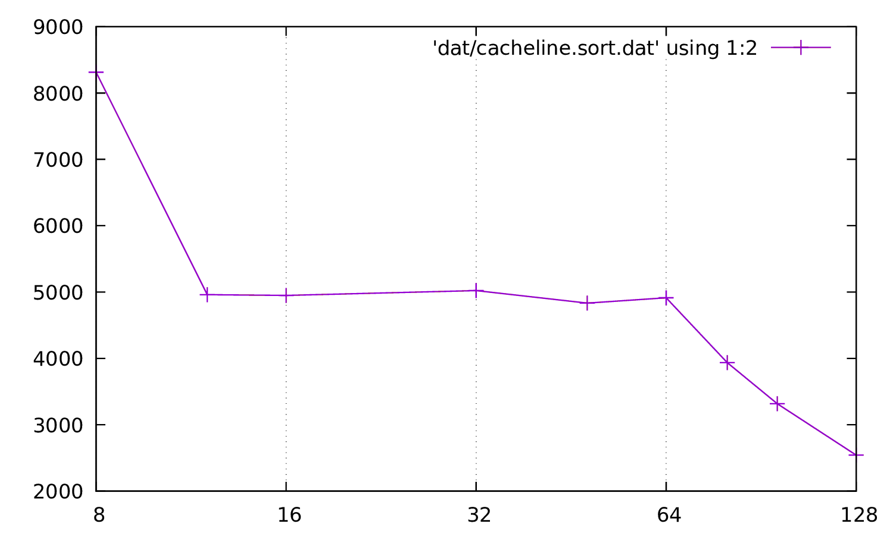

# Exo1

> Dans cet exercice, on veut mesurer la taille d’une ligne de cache. On rappelle que si un accès mémoire est fait par le processeur sur une donnée déjà en cache, un cache hit se produit et la donnée est servie rapidement depuis le cache. À l’inverse, si la donnée n’est pas en cache, un cache miss se produit et la donnée est servie lentement depuis la mémoire.
>
>On propose d’utiliser le code suivant pour déterminer la taille d’une ligne de cache.
>
>```c
> char *mem = allocate_and_touch_memory(MEMORY_SIZE);
> start_timer();
> for (i = 0; i < MEMORY_SIZE; i += PARAM)
> mem[i] = 1;
> stop_timer();
> ```
> La fonction `void *allocate and touch memory(size t size)` alloue en mémoire le nombre d’octet indiqué et initialise la nouvelle zone à zéro. De plus, les fonctions `void start timer(void)` et `void stop timer(void)` servent à mesurer le temps d’exécution de la boucle.

## Question 1
> En vous rappellant du cours de la semaine précédente, et sachant qu’on cherche à mesurer précisemment un temps d’exécution, quel est l’intérêt d’initialiser la nouvelle zone mémoire ?

## Question 2
> La boucle décrite génère-t-elle des cache hit ? Des cache miss ?


## Question 3
> Comment varient les nombres de cache miss et de cache hit quand le paramètre PARAM augmente. En particulier, comment varient-t-ils quand PARAM est très inférieur, légèrement inférieur ou supérieur à la taille d’une ligne de cache ? Quelle est approximativement la proportion de cache hit à ces trois étapes ?

## Question 4
> D’après votre réponse à la Question 3, quel est le type d’accès déterminant pour le temps d’exécution quand le paramètre PARAM est très inférieur, légèrement inférieur ou supérieur à la taille d’une ligne de cache ? Comment devrait varier le temps d’exécuion mesuré à chacune de ces trois étapes ?

## Question 5
> Le fichier `cacheline.c` contient un code similaire à celui fournit dans cet exercice. La fonction `uint64 t detect(char *mem)` diffère néamoins sur deux aspects : la boucle principale est exécutée plusieurs fois plutôt qu’une seule et est précédée par un boucle de warmup. Expliquez l’intérêt de ces deux modifications.

## Question 6
> Exécutez la commande make cacheline. Elle a pour effet de compiler le fichier `cacheline.c` avec plusieurs valeurs pour le paramètre PARAM, d’exécuter chacune des versions et de représenter les temps d’exécution sous forme graphique. Ce graphique indique en abscisee la valeur de PARAM et en ordonnée le temps d’exécution moyen de la boucle principale en nanoseconde. Déduisez de ce graphique la taille d’une ligne de cache sur votre machine.



